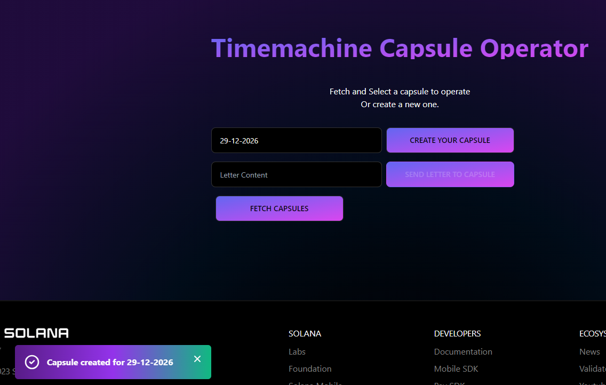

# Time machine Descentralized App

### How it works?

- Connect your Wallet
- Fetch a list of available time machines or create one
- Select the desired time machine and send a letter to it
- When the day reach, you will be able to read the letters inside it :)

### Pictures
To access the following page, is mandatory to user connect the wallet. 
#### Basics Screen

- Create your capsule:
    - This will allow the user to generate a new capsule in the blockchain

- Fetch Capsules
    - This will allow the user to fetch the capsules created by anyone in blockchain
    

- Send letter to capsule.
    - This will allow the user to send a letter inside a capsule, but before that the user need to click on a capsule to select it.
    

